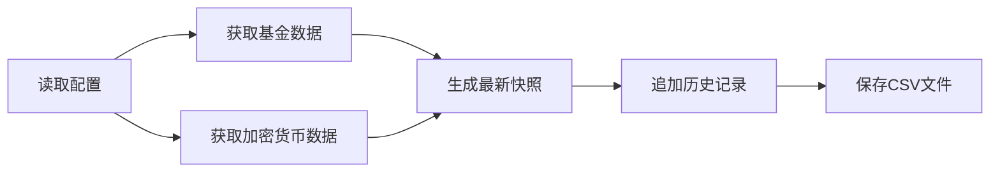

# Portfolio Aggregator

## 项目介绍

本项目是一个简单的投资数据聚合器，用于定时从第三方接口获取基金和加密货币的行情信息，并将最新价格和历史数据保存到仓库中。项目使用 GitHub Actions 自动运行脚本，生成 CSV 文件，方便通过 Excel 或其他工具实时查看资产净值、收益率等信息。

## 目录结构

```
portfolio/
├── config/
│   └── assets.json        # 资产配置文件
├── src/
│   └── aggregate.py       # 数据聚合脚本
├── .github/workflows/
│   └── daily-fetch.yml    # GitHub Actions 工作流
├── data/
│   ├── agg_latest.csv    # 最新数据快照
│   ├── history.csv       # 历史数据记录
│   └── .gitkeep          # 保持空目录
├── requirements.txt       # Python 依赖
└── README.md             # 项目说明文档
```

## 配置说明

### `config/assets.json`

资产配置文件，用于列出需要跟踪的基金代码、加密货币名称以及计价币种。修改该文件即可增删要监控的标的。

**配置示例：**

```json
{
  "funds": ["017436", "001186"],
  "coins": ["bitcoin", "ethereum", "tether"],
  "vs": ["cny", "usd"]
}
```

**字段说明：**

| 字段 | 说明 | 示例 |
|------|------|------|
| `funds` | 基金代码列表，使用天天基金的 6 位代码 | `["017436", "001186"]` |
| `coins` | 加密货币 ID，使用 CoinGecko 的标识符 | `["bitcoin", "ethereum"]` |
| `vs` | 计价币种列表 | `["cny", "usd"]` |

## 核心功能

### `src/aggregate.py`

数据聚合脚本的主要功能：

1. **数据源接口**
   - **基金数据**：通过 [DoctorXiong API](https://www.doctorxiong.club/api/) 或天天基金接口获取
     - 最新净值（NAV）
     - 估算净值（Est NAV）
     - 24小时估算涨跌幅
   - **加密货币数据**：通过 [CoinGecko API](https://www.coingecko.com/api) 获取
     - 现价（Current Price）
     - 多周期涨跌幅（1h、24h、7d、30d）

2. **数据输出**
   - `data/agg_latest.csv`：最新行情快照
   - `data/history.csv`：历史数据累积

### 工作流程



## GitHub Actions 自动化

### `.github/workflows/daily-fetch.yml`

自动化任务配置：

- **定时执行**：支持 cron 表达式设置运行频率
- **手动触发**：通过 `workflow_dispatch` 手动运行
- **自动提交**：数据更新后自动提交到仓库

## 数据文件说明

### `data/` 目录

| 文件 | 说明 | 更新方式 |
|------|------|----------|
| `agg_latest.csv` | 最新数据快照 | 每次运行覆盖 |
| `history.csv` | 历史数据记录 | 每次运行追加 |
| `.gitkeep` | 保持空目录 | 静态文件 |

## 使用指南

### 快速开始

1. **Fork 本仓库**
   ```bash
   git clone https://github.com/yourusername/portfolio.git
   cd portfolio
   ```

2. **安装依赖**
   ```bash
   pip install -r requirements.txt
   ```

3. **配置资产**
   编辑 `config/assets.json` 添加你要跟踪的基金和加密货币

4. **本地运行**
   ```bash
   python src/aggregate.py
   ```

### 自动化运行

1. 在 GitHub 仓库设置中启用 Actions
2. 编辑 `.github/workflows/daily-fetch.yml` 调整运行频率
3. 等待自动运行或手动触发工作流

### 数据分析

- 使用 Excel 打开 `data/agg_latest.csv` 查看最新行情
- 导入 `data/history.csv` 进行历史趋势分析

## 依赖项

```txt
requests
```

## 扩展建议

- 📊 增加更多数据源 API
- 📧 添加邮件或消息通知
- 💾 集成数据库存储
- 📈 开发可视化界面
- 🔔 设置价格告警机制

## 许可证

MIT License

## 贡献

欢迎提交 Issue 和 Pull Request！

---

*该项目作为模板，可根据实际需要扩展。希望能帮助你快速搭建自己的投资数据聚合系统。*
